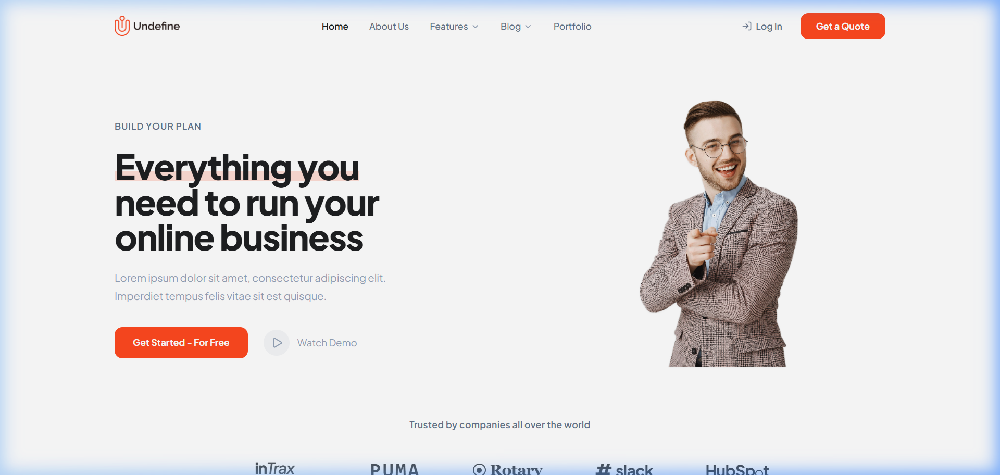
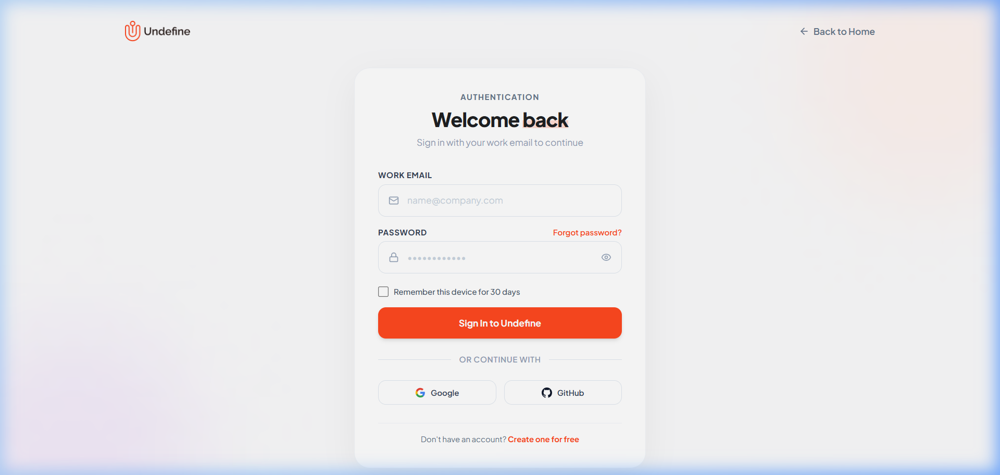
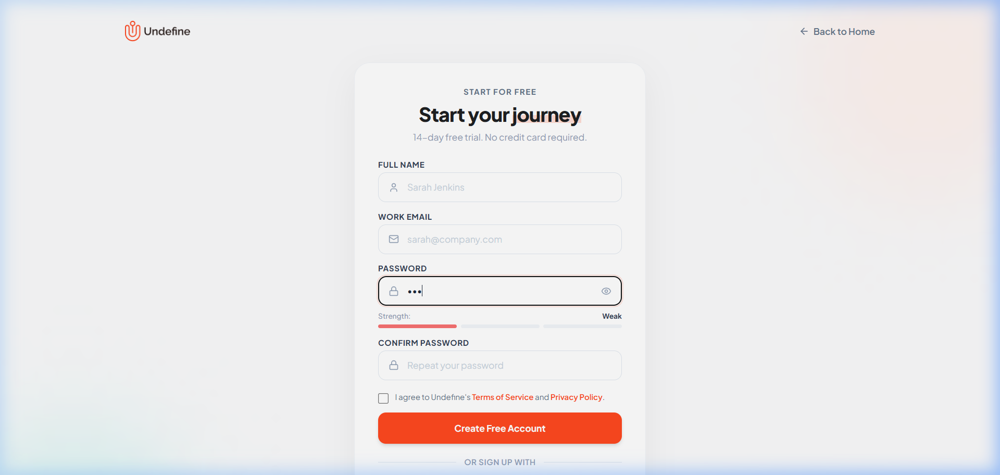
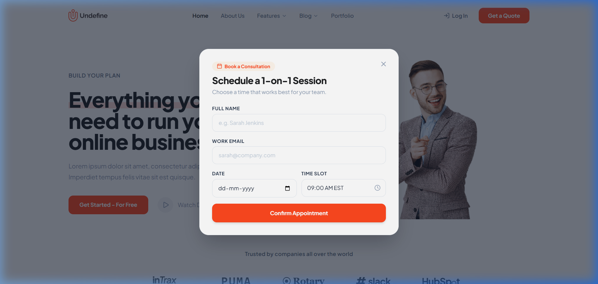

# 🚀 Undefine - Modern Business SaaS Platform & Landing Page

<div align="center">


<p align="center">
  <b>A pixel-perfect, modern business consulting & SaaS platform landing page built with React (JSX) and Tailwind CSS.</b>
</p>

[Live Demo](#quick-start) • [Features](#key-features) • [Screenshots](#-visual-showcase) • [Folder Structure](#-project-architecture) • [Getting Started](#-getting-started)

</div>

---

## 📸 Visual Showcase

### 1. Landing Page (Hero & Feature Overview)


### 2. Authentication: Login Page


### 3. Authentication: Signup Page (With Real-Time Password Strength Meter)


### 4. Interactive Consultation Booking Modal


---

## ✨ Key Features & Section Breakdown

### 🌟 1. Header & Navigation (`Navbar.jsx`)
- **Brand Identity**: Features the official **Undefine** orange emblem mark with matching typography.
- **Smart Navigation**: Smooth jump links for *Home*, *About Us*, *Features ⌵*, *Blog ⌵*, and *Portfolio* with dropdown indicators.
- **Dynamic Routing**: Seamless switcher between Landing, Login, and Signup pages with URL hash synchronization (`#home`, `#login`, `#signup`).
- **Mobile Responsive Drawer**: Clean hamburger menu with touch-friendly drawer.

### 🎯 2. Hero Section (`Hero.jsx`)
- **Signature Headline**: *"Everything you need to run your online business"* with soft salmon/pink highlight (`#FFDDD5`) under `"Everything you"`.
- **Primary & Secondary Actions**:
  - `Get Started - For Free` (vibrant orange `#FF4820` rounded button with hover lift effect).
  - `Watch Demo` (circular light-gray container with custom outlined play icon).
- **Hero Character**: High-definition entrepreneur cutout with exact scale and positioning.

### 🏢 3. Global Logo Cloud (`LogoCloud.jsx`)
- **Social Proof**: *"Trusted by companies all over the world"*.
- **Authentic Brand Marks**: Replicated logos for `inTrax`, `PUMA`, `Rotary`, `#slack`, and `HubSpot` with grayscale-to-color hover transitions.

### ⚡ 4. Feature Showcase ("What It Does" - `FeatureShowcase.jsx`)
- **Headline**: *"Supercharge your online business development"* with signature highlight.
- **Top Customers Card**: Detailed customer metrics listing Darlene Robertson (£105.483), Jane Cooper (£16.788), Ronald Richards, Esther Howard, Cody Fisher, and Theresa Webb (£1.004).
- **Total Invoice Card**: Floating analytics widget showing `520 (+12%)` with weekly distribution meter bars and Wednesday highlight.
- **Feature Rows**:
  - *Simply Copy & Paste* (elevated white card with soft drop shadow).
  - *Easy to Customize*.
  - *Made with TailwindCSS*.

### 💎 5. "Your Path to Success" Value Grid (`ProductValues.jsx`)
- **Headline**: *"Start building the products your customers want"*.
- **60 × 60 px Custom Icon Badges**:
  1. **Accelerate Time Management**: Blue Clock icon on light blue container.
  2. **Improve Security**: Amber Lock with Dollar ($) icon on light cream container.
  3. **Rise Capital Online**: Green Headset icon on light mint container.

### 💬 6. Customer Testimonials & Senior Advisor (`Testimonials.jsx`)
- **Speech Bubble Cards**: 3 elevated quote bubbles with down-pointing pointer tails:
  - *Jerome Bell* (Product Designer).
  - *Albert Flores* (Mitsubishi).
  - *Annette Black* (Louis Vuitton).
- **Consultant Cutout**: High-resolution cutout of the senior business advisor holding a tablet.

### 🔄 7. "Work Process" 3-Step Pipeline (`HowItWorks.jsx`)
- **Headline**: *"How it works"*.
- **Organic Pastel Blobs**:
  - **Step 1: Idea Validation** (Mint green organic blob with Document icon).
  - **Step 2: Business Strategy** (Lilac organic blob with 3-Slider Equalizer icon).
  - **Step 3: Implementation** (Cyan organic blob with dual overlapping cards and clockwise rotating arcs).
- **Geometric S-Wave Connectors**: Mathematically centered dashed wave arrows (`134.5 × 41.5 px`) bridging Step 1 ➔ Step 2 and Step 2 ➔ Step 3.

### 📢 8. Consulting CTA Banner (`CtaBanner.jsx`)
- **Headline**: *"Start your business journey better with our consulting"*.
- **Interactive Trigger**: Embedded curved dashed pointer pointing to `Schedule a Meeting`.

### 🔐 9. Dedicated Authentication Pages
- **Login Page (`LoginPage.jsx`)**:
  - Brand header with `Back to Home` navigation.
  - Floating inputs with show/hide password toggle.
  - Social authentication with Google and GitHub.
  - Error feedback and simulated instant sign-in.
- **Signup Page (`SignupPage.jsx`)**:
  - Real-time password strength meter (Weak / Fair / Strong).
  - Terms of Service & Privacy Policy agreements.
  - Confetti celebration animation upon account creation.

### 📅 10. Interactive Modals
- **Schedule Consultation Modal (`ScheduleModal.jsx`)**: Full booking form with date picker, time slot selector, and instant confirmation screen.
- **Video Tour Modal (`DemoModal.jsx`)**: Product overview mockup with simulated video player and key value checklist.

---

## 📂 Project Architecture

```
Business Landing Page/
├── docs/
│   └── screenshots/          # High-resolution page screenshots
│       ├── landing-page.png
│       ├── login-page.png
│       ├── signup-page.png
│       └── schedule-modal.png
├── public/
│   ├── logo-icon.svg         # Favicon icon
│   └── screenshots/          # Public assets
├── src/
│   ├── assets/               # Cutout PNGs, logo assets, and custom icons
│   │   ├── hero_man_cutout.png
│   │   ├── testimonial_man_cutout.png
│   │   ├── undefine_logo_clean.png
│   │   ├── icon_clock.png
│   │   ├── icon_lock.png
│   │   └── icon_headset.png
│   ├── components/
│   │   ├── common/           # Reusable core UI components
│   │   │   ├── Logo.jsx      # Undefine brand logo
│   │   │   ├── Navbar.jsx    # Header with dropdowns & auth triggers
│   │   │   └── Footer.jsx    # Global footer with social icons & legal links
│   │   ├── landing/          # Landing page sections
│   │   │   ├── Hero.jsx
│   │   │   ├── LogoCloud.jsx
│   │   │   ├── FeatureShowcase.jsx
│   │   │   ├── ProductValues.jsx
│   │   │   ├── Testimonials.jsx
│   │   │   ├── HowItWorks.jsx
│   │   │   └── CtaBanner.jsx
│   │   └── modals/           # Interactive dialogs
│   │       ├── ScheduleModal.jsx
│   │       └── DemoModal.jsx
│   ├── pages/                # High-level route views
│   │   ├── LandingPage.jsx   # Complete landing page
│   │   ├── LoginPage.jsx     # Undefine sign-in page
│   │   └── SignupPage.jsx    # Undefine registration page
│   ├── data/
│   │   └── mockData.js       # Top customers and metrics datasets
│   ├── App.jsx               # Client-side router & application container
│   ├── main.jsx              # React DOM entry point
│   └── index.css             # Tailwind CSS base and custom utilities
├── .vscode/
│   └── settings.json         # CSS lint configuration for Tailwind
├── index.html                # HTML entry template
├── package.json              # Project dependencies & scripts
├── tailwind.config.js        # Tailwind CSS theme configuration
└── vite.config.js            # Vite server & build configuration
```

---

## 🎨 Design System & Color Palette

| Token Name | Hex Code | Purpose / Usage |
| :--- | :--- | :--- |
| **Primary Brand** | `#FF4820` | Main CTA buttons, active tabs, brand accents |
| **Brand Hover** | `#E03A12` | Button hover and active states |
| **Soft Highlight** | `#FFDDD5` | Pastel pink background highlight behind key typography |
| **Heading Dark** | `#1E2022` | Primary headlines, logo text, bold titles |
| **Body Slate** | `#64748B` | Section kickers, secondary links, active labels |
| **Subtext Muted** | `#94A3B8` | Body paragraphs, timestamps, placeholder text |
| **Card Background** | `#FFFFFF` | Elevated cards, speech bubbles, inputs |
| **Section Accent** | `#FAFAFC` | Testimonials & subtle section backgrounds |
| **CTA Container** | `#FFF4F0` | Consulting banner container background |

---

## 🛠️ Technology Stack

- **Framework**: [React 18](https://react.dev/) (JSX)
- **Build Tool**: [Vite 8](https://vitejs.dev/)
- **Styling**: [Tailwind CSS v3.4](https://tailwindcss.com/)
- **Icons**: [Lucide React](https://lucide.dev/)
- **Animation**: [Canvas Confetti](https://www.npmjs.com/package/canvas-confetti)
- **Typography**: [Plus Jakarta Sans](https://fonts.google.com/specimen/Plus+Jakarta+Sans) & Inter

---

## 💻 Getting Started

### Prerequisites
- Node.js (v18.0.0 or higher recommended)
- npm or yarn

### 1. Clone the repository
```bash
git clone https://github.com/Sushanth666/Business-Landing-Page.git
cd Business-Landing-Page
```

### 2. Install dependencies
```bash
npm install
```

### 3. Start the local development server
```bash
npm run dev
```
Open your browser and navigate to:
```
http://localhost:5173/
```

### 4. Build for production
```bash
npm run build
```
The optimized production bundle will be generated in the `dist/` directory.

### 5. Preview production build
```bash
npm run preview
```

---

## 📱 Navigation & Routing Routes

The project supports direct client-side routing and URL hashes:

| Route / Hash | Page / View | Description |
| :--- | :--- | :--- |
| `/` or `/#home` | **Landing Page** | Full business landing page with all 8 sections |
| `/#login` | **Login Page** | Undefine branded sign-in screen |
| `/#signup` | **Signup Page** | Registration page with strength meter |

---

## 📄 License
This project is open-source and available under the [MIT License](LICENSE).
